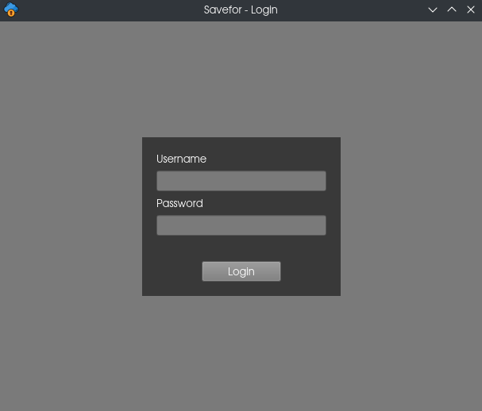
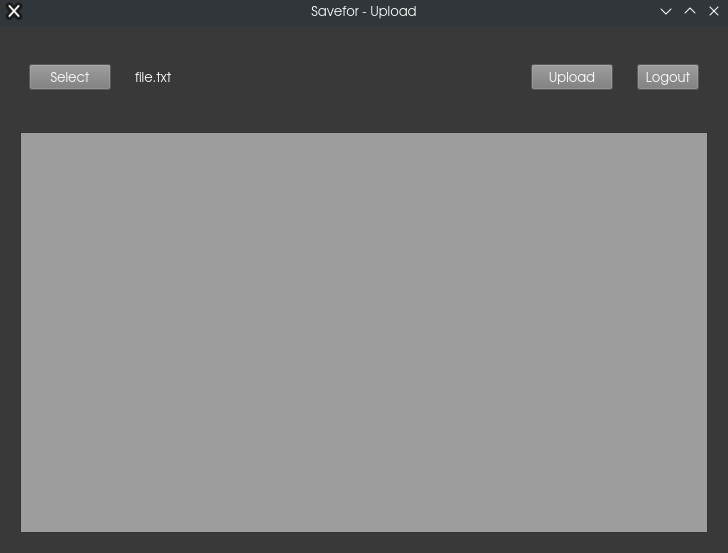
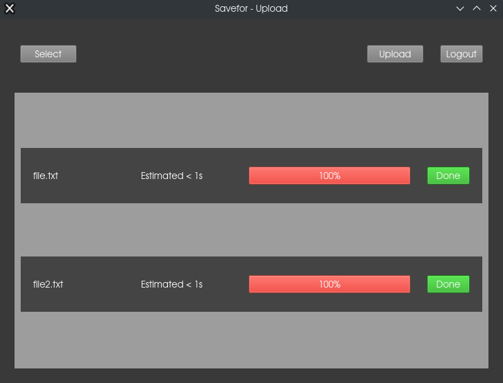

# Savefor - desktop

Savefor is a desktop app to upload files to <a href="https://github.com/gilsongindrejr/savefor-web">savefor web app</a>.

# Table of Contents
1. [About the project](#about-the-project)
    - [Features](#features)
    - [Build With](#build-with)
2. [Getting started](#getting-started)
3. [Usage](#usage)

## About the project

This project started as a code interview and became a personal project for learning Pyside/PyQt.
### features

- Upload files to <a href="https://github.com/gilsongindrejr/savefor-web">savefor web app</a>
- Manage uploaded files

### Build with
- [Python 3](https://www.python.org) - A high level programming language
- [PySide2](https://wiki.qt.io/Qt_for_Python) - Framework to build desktop apps
- [Requests](https://requests.readthedocs.io/en/latest/) - Lib to handle http requests
- [Threading](https://docs.python.org/3/library/threading.html) - Python default lib to use threads
- [Multiprocessing](https://docs.python.org/3/library/multiprocessing.html) - Python default lib to handle processes

## Getting started

### Create a virtual enviroment
```
python -m venv venv
```

### Activate the enviroment

Windows (Powershell)
```
.\venv\Scripts\Activate.ps1
```

Linux
```
source venv/bin/activate
```

### Install dependencies
```
pip install -r requirements.txt
```

### Execute the app
```
python main.py
```

## Usage


### Login

With the web server on, log in using the username and password created on the web app.



### Upload

Select a file with ``select`` button and send the file with ``upload`` button.



The app will show a card for the file with its name, estimated time to upload, a progress bar and a cancel/done button.



### Closing the app

To close the app just click on the app icon in the system tray bar and select ```quit```.
